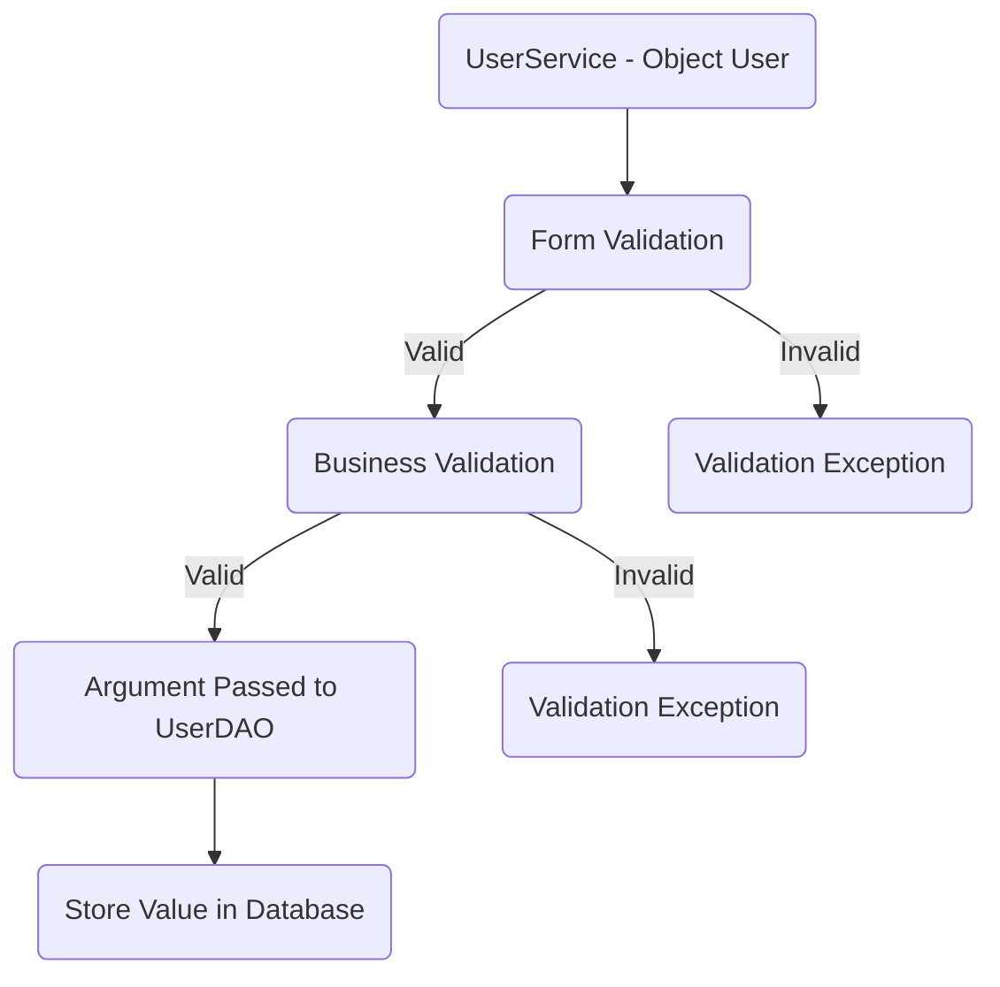
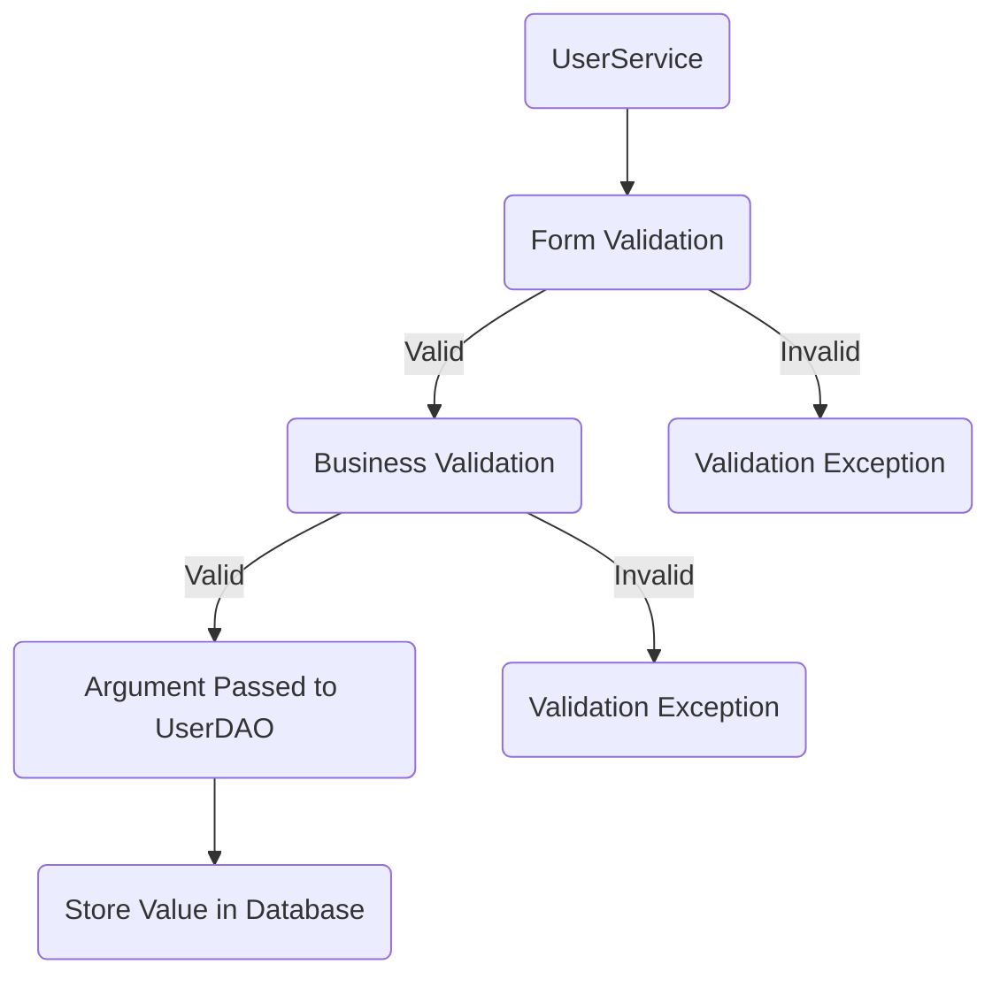
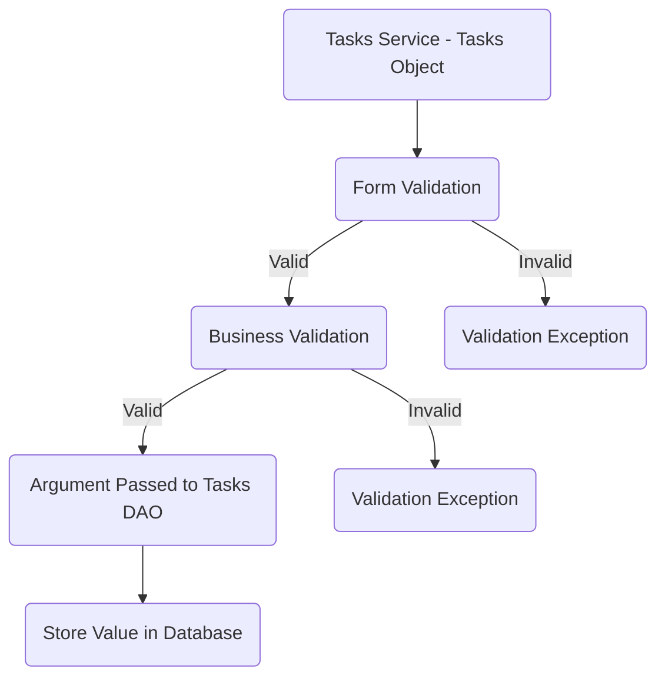
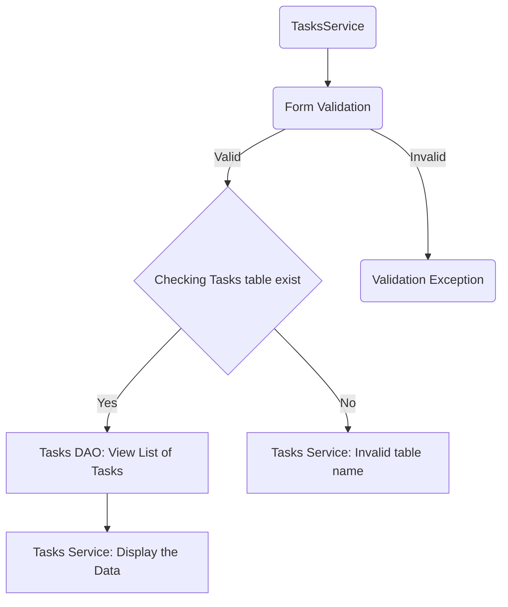
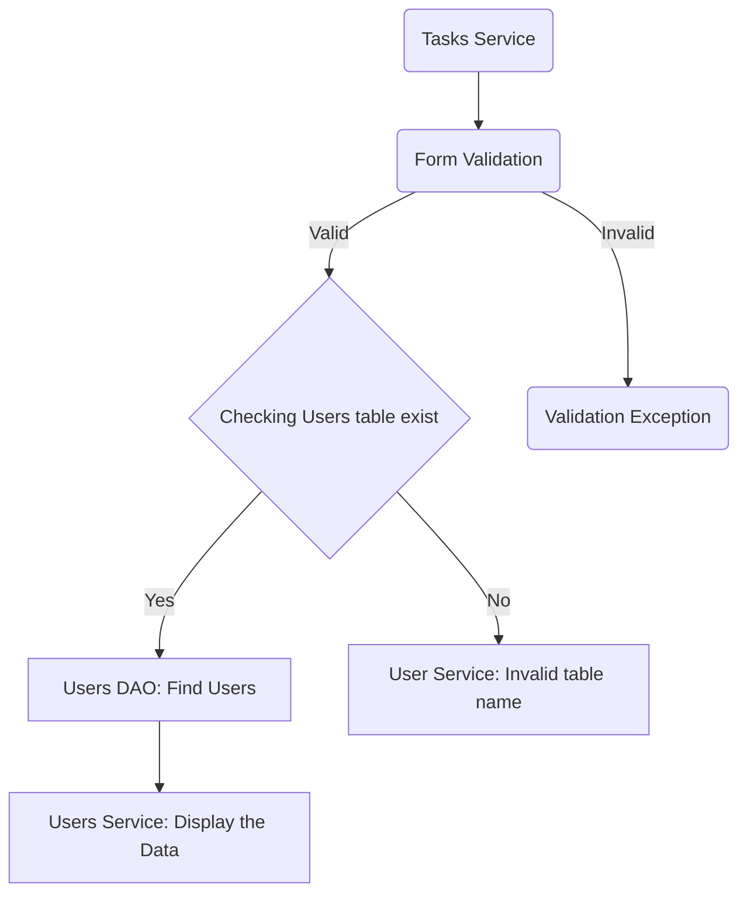
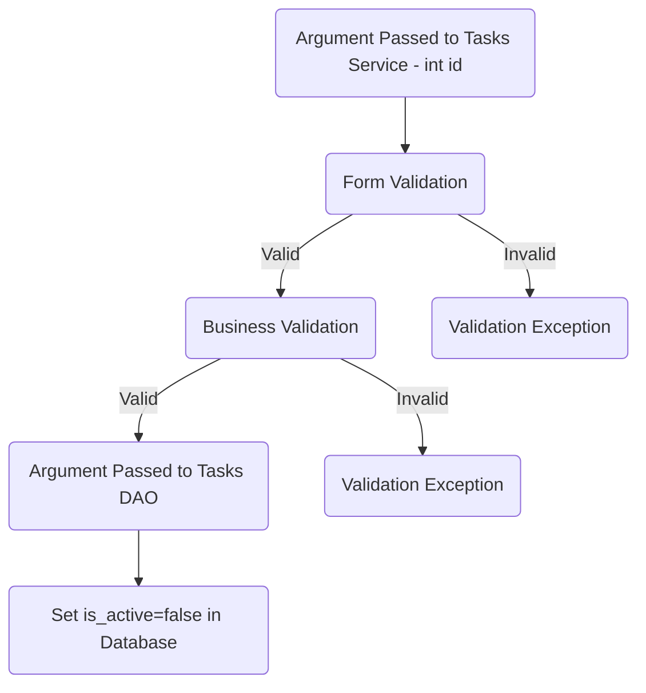

## Database Design

- [ ] Create an ER diagram of the database
- [ ] Write Create table scripts [script](path/to/sql/file)

### ER Diagram

## Project Setup

- [ ] Create a new Java project
- [ ] Set up a MySQL database
- [ ] Add necessary libraries
	- [ ] JDBC, 
	- [ ] MySQL Connector, 
	- [ ] JUnit, 
	- [ ] Dotenv

## Module 1: User

* Attributes
	 * int id
	 * String Name  
	 * String Email
	 * String Password

### Feature 1: Create User

### User Story:

User created successfully and the user details will be   	stored in the database.
				
### Pre-requisites: 
- [ ] User Table
- [ ] User Model
- [ ] User DAO (create)
- [ ] User Service (create)

#### Validations:

- [ ] Form Validation
    *  User null
	* Name ( Null , Empty , Pattern )
	* Email ( Null , Empty , Pattern )
	* Password ( Null , Empty , Pattern )

- [ ] Business Validation
	* Email Already Exists

#### Messages:
* User Object Cannot Be Null  
* User Cannot be Null
* Name cannot be Null or Empty  
* Name should be match with the given Pattern  
* Email cannot be Null or Empty  
* Email Should be match with the given Pattern  
* Password cannot be Null or Empty  
* Password must contains at least 8 characters  
* Password should be match with the given Pattern  
* User already exists

#### Flow:  
> Invalid When a User's Email is already in use or when the input provided does not meet the criteria, users arise.
> 

### Feature 2 : Update User

### User story :  

User details successfully updated and stored in database.

### Pre-requisites:-User DAO( Update user )

- [ ] Completed feature 1 - Create User  
- [ ] User dao ( Update )  
- [ ] User service ( Update )

#### Validations:

- [ ] Form Validator
  
* User ( Null )
* Id cannot be 0 or in negative  
* Name ( Null , Empty, Pattern )  
* Password (Null , Empty, Pattern )

- [ ] Business Validation  
* Check whether the id exist

#### Messages:

* Id cannot be 0 or in negative  
* Email cannot be null or empty  
* Email should be match with the given pattern  
* Name cannot be null or empty  
* Name should be match with the given pattern  
* Password cannot be null or empty  
* Password must contains at least 8 characters  
* Password should match with the given pattern  
* User not found

#### Flow:  

> Invalid When a User's  Email is not in use or when the input provided does not meet the criteria, users arise.

## Module 2 : Tasks

* Attributes
	 * int id
	 * String Name  
	 * String Description
	 * String Created By
	 *  String Created At
	 *  String Status
	 * String Parent Task

### Feature 3: Create Tasks

### User Story;

Tasks created and Successfully Tasks details stored in the database.

### Pre-Requisites:- [ ] Tasks DAO ( Create Tasks )

- [ ] Tasks Table  
- [ ] Tasks Model
- [ ] Tasks DAO 
- [ ] Tasks service ( Create )

#### Validations:

- [ ] Form Validation
    * Task ( Null )
	* Name ( Null , Empty , Pattern )
	* Description ( Null , Empty , Pattern )
	* Status ( Null , Empty , Pattern )
	* Parent Task ( Null , Empty , Pattern )

#### Messages:* Tasks Object Cannot be Null  

* Name cannot be Null or Empty  
* Name should be match with the given Pattern  
* Description cannot be Null or Empty 
* Status cannot be Null or Empty   
*  Status cannot be Null or Empty   
* Tasks already exists

#### Flow:

> Invalid When a category's name is already in use or when the input provided does not meet the criteria, categories arise.

### Feature 4: List All Tasks

### User Story;

All Tasks Lists created and Successfully All Tasks List details stored in the database.

### Pre-requisites:- 
- [ ] Completed feature 1 - Create Task
- [ ] Task Dao ( Update )  
- [ ] Task service ( Update )

#### Validations:

#### Messages:
* Tasks Object Cannot be Null  
* Table Value not Found

#### Flow:

### Feature 5: List All Users Tasks

### User Story;
>Take Single User list of Tasks

### Pre-requisites:- 
- [ ] Completed feature 1 - Create Task
- [ ] Task Dao ( Update )  
- [ ] Task service ( Update )

#### Validations:

- [ ] Form Validation
	* Id cannot be 0 or in negative  
	
#### Messages:

* Tasks Object Cannot be Null  
* Table not Found

#### Flow:

### Feature 6: Update Users Task Details

### User Story;
User  Tasks  details successfully updated and stored in database.

### Pre-requisites:- 
- [ ] Completed feature 1 - Create Task
- [ ] Task Dao ( Update )  
- [ ] Task service ( Update )

#### Validations:

- [ ] Form Validation
	* Task ( Null )
	* Id cannot be 0 or in negative 
	* Name ( Null , Empty , Pattern )
	* Description ( Null , Empty , Pattern )
	* Status ( Null , Empty , Pattern ) 

- [ ] Business Validation
		* Tasks must be  Already Exists

#### Messages:
* Tasks Object Cannot be Null  

#### Flow:

### Feature 7 : Delete User Task

### User story :

User Task is deleted successfully.

### Pre-requisites:- [ ] category DAO( Delete User Task)  

- [ ] complete feature 1 - create Task
- [ ] Task Dao ( Delete )
- [ ] Task service ( Delete )

#### Validations:  
 ​- [ ] form Validation 
  
	* id (less than or equal to 0) 
	* Name (null, empty, pattern)
	
- [ ]  Business Validation  

	* Check whether the id or name exists

#### Messages:

* Id cannot be 0 or in negative
* Name cannot be null or empty
* Name should be match with the given pattern
* User Tasks id or name does not exists 

#### Flow:  

### Feature 7 : Update User Task Status

### User story :

User Task Status Stored Successfully successfully.

### Pre-requisites:- [ ] category DAO( Update User Task Status)  

- [ ] complete feature 1 - create Task
- [ ] Task Dao ( Update )
- [ ] Task service ( Update )

​
#### Validations:  

​- [ ] Form Validation 
	* id (less than or equal to 0) 

- [ ]  Business Validation  
	* Check whether the id  exists

​

#### Messages:

* Id cannot be 0 or in negative
* User Tasks id  does not exists 

#### Flow:  

